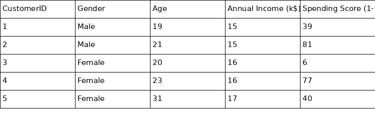
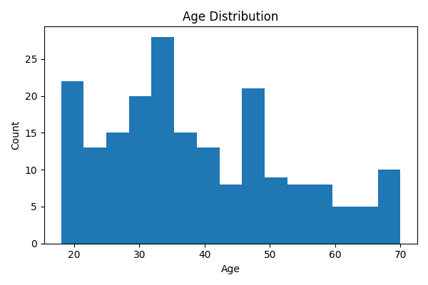
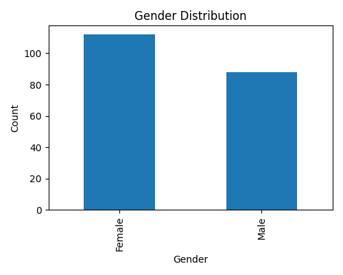
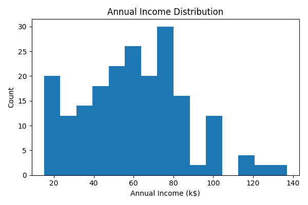
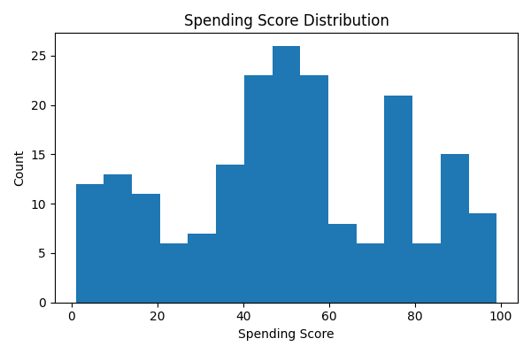
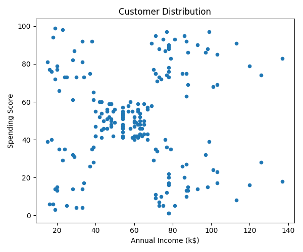
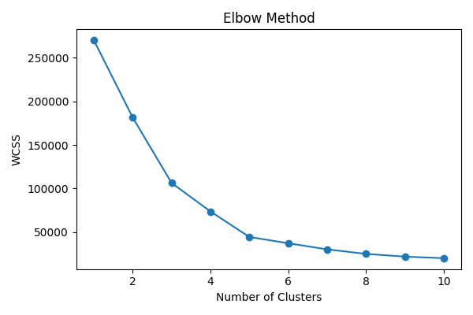
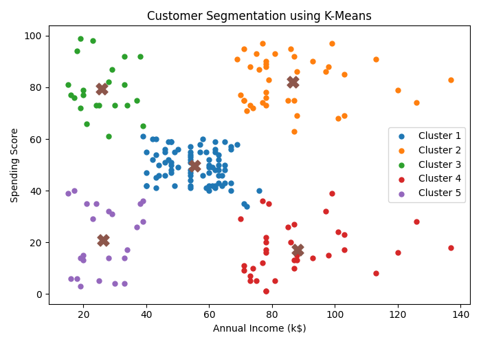

# Adaptive K-Means Customer Segmentation

## Project Overview
This project uses the K-Means Clustering algorithm to segment customers into different groups based on their purchasing behavior. Customer segmentation helps businesses understand their customers and create targeted marketing strategies.

## Objective
- Perform customer segmentation using K-Means Clustering.
- Identify distinct customer groups.
- Visualize clusters for better business insights.

## Technologies Used
- Python
- Pandas
- NumPy
- Matplotlib
- Seaborn
- Scikit-learn
- Google Colab

## Machine Learning Algorithm
- K-Means Clustering (Unsupervised Learning)

## Project Workflow
1. Data Loading
2. Data Preprocessing
3. Exploratory Data Analysis
4. Feature Selection
5. K-Means Model Training
6. Cluster Visualization
7. Customer Segment Analysis

## Project Outcome
The model successfully groups customers into meaningful clusters, enabling better customer understanding and data-driven decision making.

Created by Anushka G

# 📸 Project Screenshots

### Dataset Preview

### Age Distribution

### Gender Distribution

### Annual Income Distribution

### Spending Score Distribution

### Customer Distribution

### Elbow Method

### Customer Segmentation (K-Means)

---
Created by Anushka G
